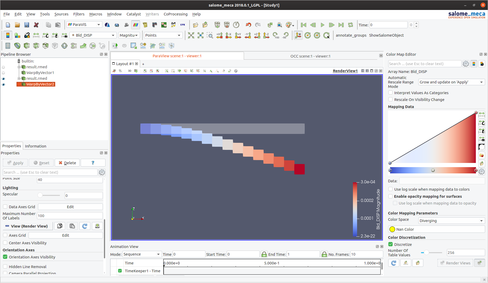
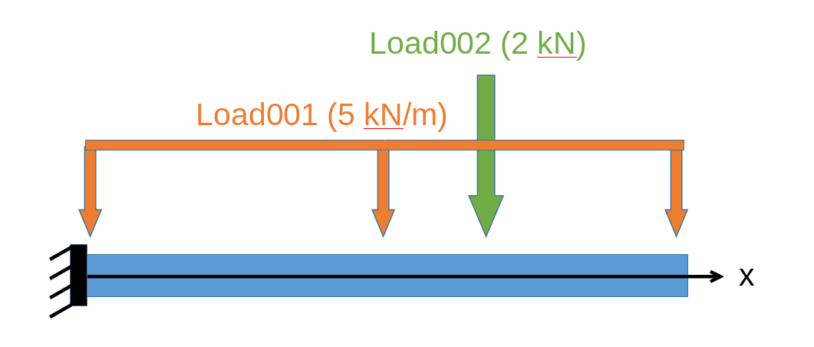

# ifc2ca
Files and scripts for a Proof of Concept regarding the use of Code_Aster in IFC-driven FEM analyses within the ifcOpenShell/BlenderBim Project

### File Organisation
#### Scripts:
- [`ifc2ca.py`](ifc2ca.py): a python script to extract and create the `json` file from an `ifc` file. This file will be synchronized with the one in [`BlenderBIM`](https://github.com/IfcOpenShell/IfcOpenShell/tree/v0.6.0/src/ifcblenderexport/ifc2ca.py)
- [`scriptSalome.py`](scriptSalome.py): a python script to run in the Salome_Meca environment. Creates the geometry and the mesh of the structure
- [`cliCodeAster.py`](cliCodeAster.py): a python cli to create the input file (`.comm`) for Code_Aster. Use `run.py` to facilitate the use

---

#### Examples
##### _cantilever_01_
Input
- [`ifc2ca.json`](examples/cantilever_01/ifc2ca.json): json data file of a cantilever beam under its own weight
- [`bldMesh.med`](examples/cantilever_01/bldMesh.med): mesh file exported from Salome_Meca after executing `scriptSalome`
- [`CA_input_00.comm`](examples/cantilever_01/CA_input_00.comm): command file generated from `cliCodeAster`

Output
- [`result.mess`](examples/cantilever_01/result.mess): message log file of the interpreted commands in Code_Aster
- [`result.rmed`](examples/cantilever_01/result.rmed): result file on the mesh of the structure to visualize in Salome_Meca

##### _portal_01_
Input
- [`ifc2ca.json`](examples/portal_01/ifc2ca.json): json data file of a cantilever beam under its own weight
- [`bldMesh.med`](examples/portal_01/bldMesh.med): mesh file exported from Salome_Meca after executing `scriptSalome`
- [`CA_input_00.comm`](examples/portal_01/CA_input_00.comm): command file generated from `cliCodeAster`

Output
- [`result.mess`](examples/portal_01/result.mess): message log file of the interpreted commands in Code_Aster
- [`result.rmed`](examples/portal_01/result.rmed): result file on the mesh of the structure to visualize in Salome_Meca

---

### Current Status
_As of 26/02/20:_
- Added portal example
- Changed `section` to `profile` and added I profile
- Modified material and profile schema with mechanical and common properties
- Added geometry identification for point connection from representation
- Added connections along with supports based on the number of elements a connection is applied to
- Applied conditions with elastic stiffness values is still not implemented. Only True/False values are accepted.

_As of 09/02/20:_
- Loads, load cases and load case combinations added in the example `inputDataCA.json` file
- Implementation in BlenderBIM under way

 

_As of 16/01/20:_
- Only line geometries for structural elements and point geometries for supports are considered
- The structure is analysed for gravity loads with a single linear static analysis
