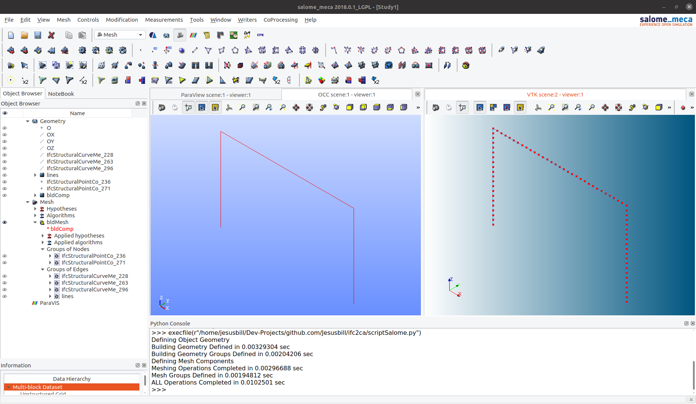
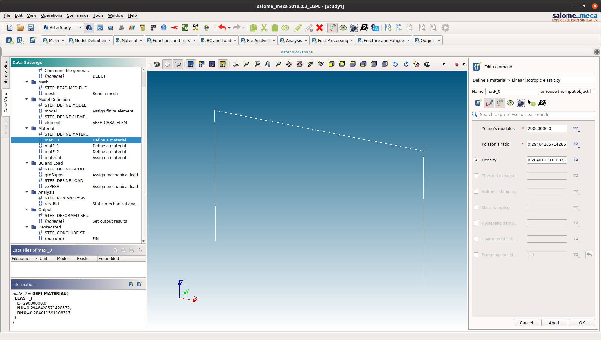
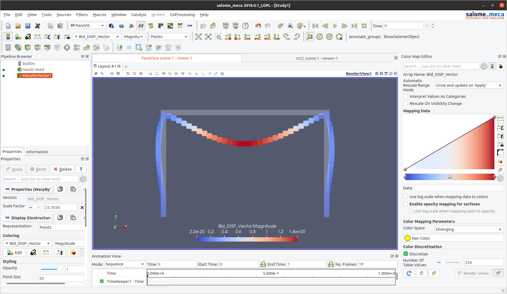

##### portal_01

Running `scriptSalome.py` in _salome_meca_. View of Geometry and Mesh

Importing the command file in _asterStudy_, the module with the UI to configure and run analyses with Code_Aster

Viewing the results in _ParaViS_, the port of ParaView in the ecosystem

